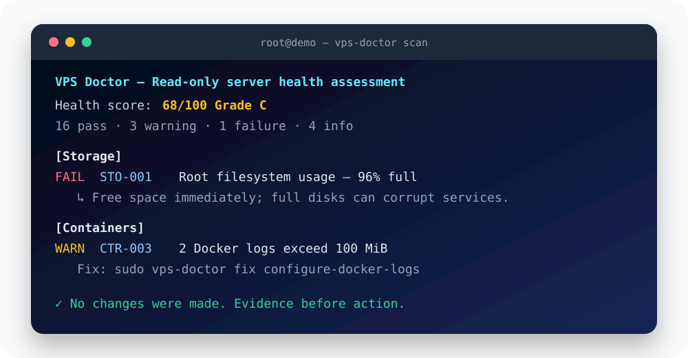

<div align="center">
  
  <h1>VPS Doctor</h1>
  <p><strong>一条命令诊断常见 VPS 故障，然后安全地修复。</strong></p>
  <p><a href="README.md">English</a> · <a href="docs/rules.md">检查规则</a> · <a href="docs/repairs.md">修复安全</a> · <a href="ROADMAP.md">路线图</a></p>
</div>



VPS Doctor 是一个“默认只读”的 Linux 服务器诊断工具，适合小型 VPS、家庭实验室和自托管服务。它把分散的系统信息整理成健康分数、可执行建议和经过脱敏的诊断报告。

## 它解决什么问题

服务器变慢、磁盘爆满或网站打不开时，新手通常需要到处搜索并执行许多命令。VPS Doctor 一次检查完整故障链：

`磁盘 → 内存 → 服务 → 网络 → SSH → 防火墙 → Docker → 网站/TLS`

扫描过程中不会安装常驻程序、开放端口、上传遥测数据或修改系统。

## 快速开始

在克隆后的项目目录中运行：

```bash
sudo bash ./install.sh
sudo vps-doctor scan
```

项目发布后，可以使用一条命令安装：

```bash
curl -fsSL https://raw.githubusercontent.com/wcnmd666/vps-doctor/main/install.sh | sudo bash
```

正式服务器建议下载带版本号的 Release、核对校验值并阅读安装脚本后再执行，不建议盲目信任任何通过网络直接传给 root 的脚本。

## 主要能力

- 检查 CPU、内存、Swap、磁盘空间和 inode；
- 检查 OOM、失败的 systemd 服务和待重启状态；
- 检查默认路由、DNS 和监听端口；
- 检查防火墙、SSH 策略、暴力登录记录和自动安全更新；
- 检查 Docker 服务、异常容器和过大的容器日志；
- 检查 Nginx、Apache、Caddy，以及可选的域名和 TLS 证书；
- 输出终端、JSON 或 Markdown 报告；
- 每项问题都有固定规则编号、证据、严重程度和建议。

## 常用命令

```bash
sudo vps-doctor scan
sudo vps-doctor scan --quick
sudo vps-doctor scan --format json --output report.json
sudo vps-doctor scan --format markdown --output report.md
sudo vps-doctor scan --fail-under 75
```

## 安全修复

扫描永远只读。修复命令与扫描分开，必须使用 root、明确显示操作内容并经过确认：

```bash
sudo vps-doctor fixes
sudo vps-doctor fix vacuum-journal --dry-run
sudo vps-doctor fix vacuum-journal
sudo vps-doctor fix create-swap --size 2G
```

工具会拒绝危险猜测：不会自动合并已有的 Docker JSON 配置，不会贸然启用可能导致 SSH 失联的防火墙，也不会自动修改 SSH 登录策略。详见 [修复安全说明](docs/repairs.md)。

## 隐私

项目没有遥测。报告会尝试隐藏当前用户名、主机名、IPv4 地址和常见密钥赋值，但自动脱敏不可能覆盖所有情况，公开报告前仍需人工检查。详见 [隐私说明](docs/privacy.md)。

## 支持范围

首版重点支持 Ubuntu 20.04/22.04/24.04 和 Debian 11/12/13；其他使用 systemd 的 Linux 会以尽力而为方式运行。需要 Bash 4.4 或更高版本。

当前版本为 `v0.1.0` 预览版。诊断结果不是安全认证，请先在临时服务器测试修复功能。
